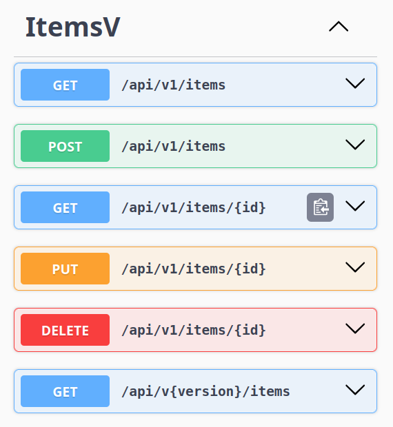
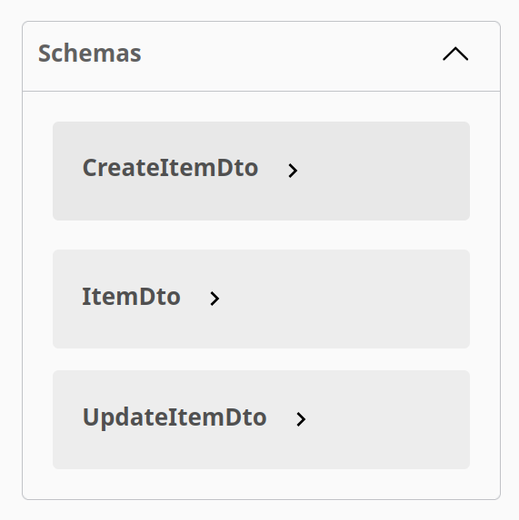
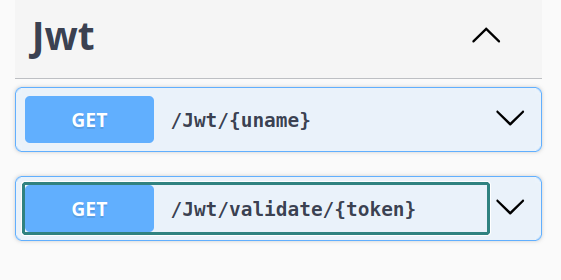
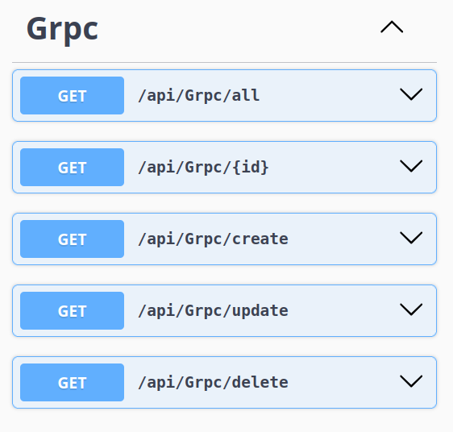

# my implementations of architectures..  ☄️

**C# dotnet**

- Microservices Architecture (Docker)

 

**ItemService**

- Clean Architecture
- Mongodb
- MediatR/CQRS DessignPattern
- ApiVersioning
- HttpClient HTTP/REST-Polly -> JwtService
- gRPC Client -> GrpcService
     
   

 

**JwtService**
- Create JWT Token
- Validate Token
      

 

**GrpcService**
- gRPC Server - CRUD Operations
      
